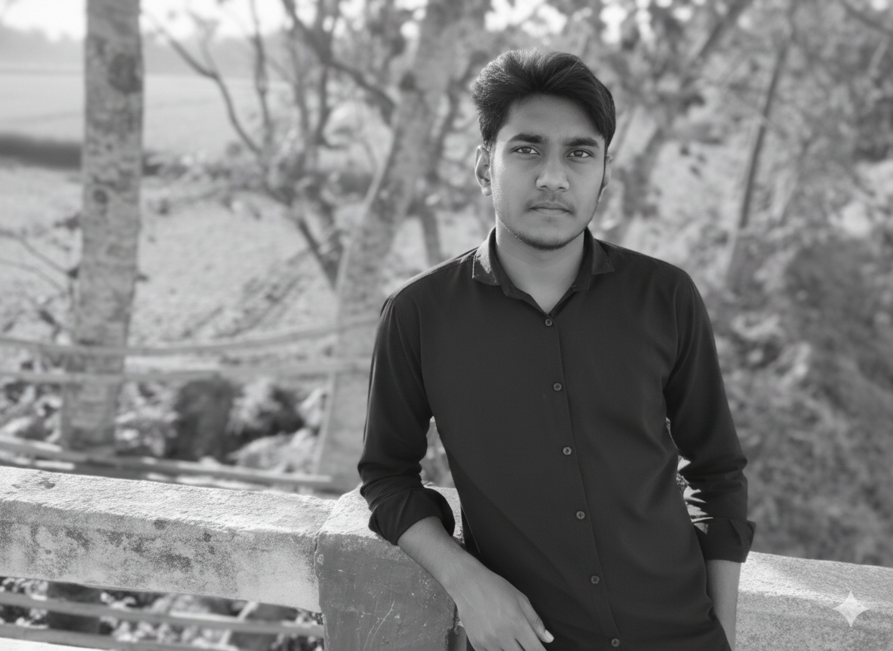
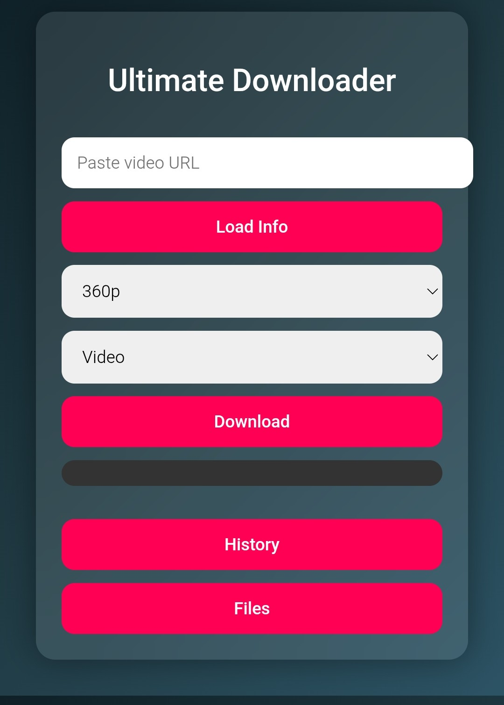

# Video-download-

YouTube Video Downloader Project
<p align="center">
  
</p>
---

## 🎯 Overview

Download YouTube videos in multiple resolutions with a simple web interface.

---

## ⚡ Requirements

- Python 3.13+
- pip
- Flask
- yt-dlp
- Optional: NodeJS (for full YouTube extraction support)

---

# Video-download Setup Guide

---

## 🛠 Step 1️⃣: Update & Install Packages

```bash
# Update Termux / Linux
pkg update && pkg upgrade -y

# Install Python & Git
pkg install python git -y

# Optional: NodeJS for full YouTube extraction support
pkg install nodejs -y

# Upgrade pip
pip install --upgrade pip

# Install required Python packages
pip install flask
pip install yt-dlp
pkg install ffmpeg
termux-setup-storage
```

🛠 Step 2️⃣: Clone Project
Bash
Copy code
# Prepare Zihad folder
```bash
mkdir -p /storage/emulated/0/Zihad
cd /storage/emulated/0/Zihad

# Remove old copy if exists
rm -rf Video-download-

# Clone GitHub repo
git clone https://github.com/zihadza/Video-download-.git
cd Video-download-
```
🛠 Step 3️⃣: Run Python Server
Bash
Copy code
# Run the Flask app
```bash
cd /storage/emulated/0/Zihad/Video-download-
nohup python merge.py > merge.log 2>&1 &
nohup python app.py > app.log 2>&1 &
```
⚠️ Make sure port 3030 is free.
Optional: NodeJS recommended for better YouTube extraction.

🛠 Step 4️⃣: Open in Browser
Plain text
Copy code
```bash
http://localhost:3030
```


# Zihad Video Downloader & Auto Merge Tool

**আপনি এই টুলটি ব্যবহার করে যেকোনো প্ল্যাটফর্ম থেকে ভিডিও ডাউনলোড করতে পারবেন এবং সেগুলিকে একসাথে মর্জ করে দেখতে পারবেন।**

---
<p align="center">
  
</p>
## ⚡ বৈশিষ্ট্যসমূহ

1. **Supported Platforms:**
   - YouTube
   - Facebook
   - TikTok
   - Instagram
   - অন্যান্য প্ল্যাটফর্ম যেখান থেকে ভিডিও URL পাওয়া যায়

2. **Video Quality Selection:**
   - 360p, 480p, 720p, 1080p পর্যন্ত ভিডিও ডাউনলোড করা যাবে।

3. **Audio & Video Merge:**
   - যেকোনো ভিডিও ডাউনলোড হলে যদি আলাদা ভিডিও (`.mp4`) ও অডিও (`.m4a`) ফাইল থাকে, সেগুলো **স্বয়ংক্রিয়ভাবে মর্জ করা হয়**।
   - Merge হওয়া ভিডিও **original quality বজায় থাকে** এবং `.mp4` ফরম্যাটে থাকে।

4. **File Location & Folder Structure:**
   - সব ডাউনলোড করা ফাইল মূল ফোল্ডারে থাকে:
   - আপনি ফাইল লোকেশন চালু করুন এবং ফাইল কে অনুমোদন দিন 
     ```
     /storage/emulated/0/Zihad/Video-download-
     ```
   - মর্জ হয়ে যাওয়া ফাইলগুলো থাকে:
     ```
     /storage/emulated/0/Zihad/Video-download-/merged
     ```
   - Merge হওয়ার পর **মূল ভিডিও ও অডিও ফাইলগুলো স্বয়ংক্রিয়ভাবে ডিলিট হয়ে যায়**, শুধু merged ভিডিও থাকে।

5. **Video Player Compatibility:**
   - MX Player, VLC Player, এবং Android এর ডিফল্ট ভিডিও প্লেয়ার সবগুলোতেই চলবে।
   - যদি সরাসরি মূল ডাউনলোড ফোল্ডার থেকে প্লে করতে যাওয়া হয়, কিছু ফাইল দেখা নাও যেতে পারে। **সর্বদা `merged` ফোল্ডার থেকে ভিডিও চালান।**

6. **Special Notes:**
   - `.temp.webm` ফাইলগুলো incomplete download নির্দেশ করে, এগুলো ignore করা হয়।
   - ভিডিওর নামের বিশেষ চিহ্ন (`|`, `–`, `:` ইত্যাদি) স্বয়ংক্রিয়ভাবে ঠিক করা হয় যাতে প্লেয়ার এ কোন সমস্যা না হয়।

---

## 🛠️ Installation & Run

1. Python & FFmpeg ইনস্টল থাকা আবশ্যক।
2. Terminal / Termux এ ক্লোন করুন বা ফোল্ডারটি খুলুন।
3. Dependencies check:
   ```bash
   pip install flask yt-dlp
