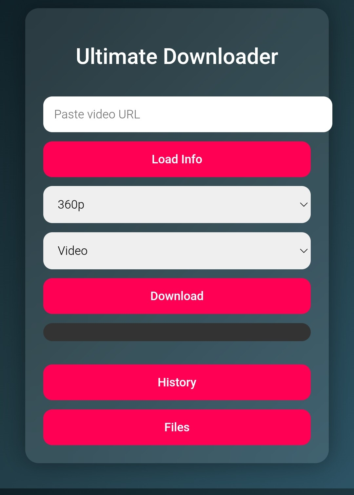

# Video-download-

YouTube Video Downloader Project
<p align="center">
  
</p>
---

## 🎯 Overview

Download YouTube videos in multiple resolutions with a simple web interface.

---

## ⚡ Requirements

- Python 3.13+
- pip
- Flask
- yt-dlp
- Optional: NodeJS (for full YouTube extraction support)

---

# Video-download Setup Guide

---

## 🛠 Step 1️⃣: Update & Install Packages

```bash
# Update Termux / Linux
pkg update && pkg upgrade -y

# Install Python & Git
pkg install python git -y

# Optional: NodeJS for full YouTube extraction support
pkg install nodejs -y

# Upgrade pip
pip install --upgrade pip

# Install required Python packages
pip install flask
pip install yt-dlp
pkg install ffmpeg
termux-setup-storage
```

🛠 Step 2️⃣: Clone Project
Bash
Copy code
# Prepare Zihad folder
```bash
mkdir -p /storage/emulated/0/Zihad
cd /storage/emulated/0/Zihad

# Remove old copy if exists
rm -rf Video-download-

# Clone GitHub repo
git clone https://github.com/zihadza/Video-download-.git
cd Video-download-
```
🛠 Step 3️⃣: Run Python Server
Bash
Copy code
# Run the Flask app
```bash
cd /storage/emulated/0/Zihad/Video-download-
nohup python merge.py > merge.log 2>&1 &
nohup python app.py > app.log 2>&1 &
```
⚠️ Make sure port 3030 is free.
Optional: NodeJS recommended for better YouTube extraction.

🛠 Step 4️⃣: Open in Browser
Plain text
Copy code
```bash
http://localhost:3030
```


# Zihad Video Downloader & Auto Merge Tool

**আপনি এই টুলটি ব্যবহার করে যেকোনো প্ল্যাটফর্ম থেকে ভিডিও ডাউনলোড করতে পারবেন এবং সেগুলিকে একসাথে মর্জ করে দেখতে পারবেন।**

---
<p align="center">
  
</p>
## ⚡ বৈশিষ্ট্যসমূহ

1. **Supported Platforms:**
   - YouTube
   - Facebook
   - TikTok
   - Instagram
   - অন্যান্য প্ল্যাটফর্ম যেখান থেকে ভিডিও URL পাওয়া যায়

2. **Video Quality Selection:**
   - 360p, 480p, 720p, 1080p পর্যন্ত ভিডিও ডাউনলোড করা যাবে।

3. **Audio & Video Merge:**
   - যেকোনো ভিডিও ডাউনলোড হলে যদি আলাদা ভিডিও (`.mp4`) ও অডিও (`.m4a`) ফাইল থাকে, সেগুলো **স্বয়ংক্রিয়ভাবে মর্জ করা হয়**।
   - Merge হওয়া ভিডিও **original quality বজায় থাকে** এবং `.mp4` ফরম্যাটে থাকে।

4. **File Location & Folder Structure:**
   - সব ডাউনলোড করা ফাইল মূল ফোল্ডারে থাকে:
   - আপনি ফাইল লোকেশন চালু করুন এবং ফাইল কে অনুমোদন দিন 
     ```
     /storage/emulated/0/Zihad/Video-download-
     ```
   - মর্জ হয়ে যাওয়া ফাইলগুলো থাকে:
     ```
     /storage/emulated/0/Zihad/Video-download-/merged
     ```
   - Merge হওয়ার পর **মূল ভিডিও ও অডিও ফাইলগুলো স্বয়ংক্রিয়ভাবে ডিলিট হয়ে যায়**, শুধু merged ভিডিও থাকে।

5. **Video Player Compatibility:**
   - MX Player, VLC Player, এবং Android এর ডিফল্ট ভিডিও প্লেয়ার সবগুলোতেই চলবে।
   - যদি সরাসরি মূল ডাউনলোড ফোল্ডার থেকে প্লে করতে যাওয়া হয়, কিছু ফাইল দেখা নাও যেতে পারে। **সর্বদা `merged` ফোল্ডার থেকে ভিডিও চালান।**

6. **Special Notes:**
   - `.temp.webm` ফাইলগুলো incomplete download নির্দেশ করে, এগুলো ignore করা হয়।
   - ভিডিওর নামের বিশেষ চিহ্ন (`|`, `–`, `:` ইত্যাদি) স্বয়ংক্রিয়ভাবে ঠিক করা হয় যাতে প্লেয়ার এ কোন সমস্যা না হয়।

---

## 🛠️ Installation & Run

1. Python & FFmpeg ইনস্টল থাকা আবশ্যক।
2. Terminal / Termux এ ক্লোন করুন বা ফোল্ডারটি খুলুন।
3. Dependencies check:
   ```bash
   pip install flask yt-dlp


# ⚡ ZihadIDE + Ultimate Downloader

একটি সম্পূর্ণ Mobile IDE + Video Downloader যেটা Android + Termux-এ চলে।
সব প্রোগ্রামিং language, Android app build system, এবং video downloader সব একসাথে।


---

## 📋 Table of Contents

1. [কী কী আছে](#-কী-কী-আছে)
2. [Step 1: Termux Update](#-step-1-termux-update)
3. [Step 2: সমস্ত Language ইনস্টল](#-step-2-সমস্ত-language-ইনস্টল-একসাথে)
4. [Step 3: Android SDK + Gradle সেটআপ](#-step-3-android-sdk--gradle-সেটআপ)
5. [Step 4: Python Packages](#-step-4-python-packages)
6. [Step 5: aapt2 Fix](#-step-5-aapt2-arm64-fix)
7. [Step 6: Environment Setup](#-step-6-environment-setup)
8. [Step 7: Server File ডাউনলোড](#-step-7-server-file-ডাউনলোড)
9. [Step 8: Server চালাও](#-step-8-server-চালাও)
10. [Quick Reference — সব command একসাথে](#-quick-reference--সব-command-একসাথে)
11. [Troubleshooting](#-troubleshooting)
12. [Aliases & Auto-Start](#-aliases--auto-start)

---

## 🎯 কী কী আছে

### 🖥️ IDE (Python Flask)
- Code Editor (CodeMirror) — 20+ language syntax highlighting
- File Explorer
- Terminal
- Error Scanner (Python, C, C++, JS, PHP, Go, Ruby, Bash)
- APK Builder (Gradle + Android SDK)
- Live Build Progress

### 📥 Video Downloader (Python Flask)
- YouTube Search
- Video Info + Thumbnail
- Multi-quality download (1080p, 720p, 480p, 360p)
- MP3 audio extraction
- Live progress (speed, ETA, size)
- Files, History, Favorites

### 🌐 Supported Languages
| Language | Runtime | Version |
|---|---|---|
| 🐍 Python | python | 3.12+ |
| ⚙️ C | clang | 18+ |
| ⚙️ C++ | clang++ | 18+ |
| ☕ Java | openjdk-21 | 21 |
| 🟣 Kotlin | (via Java) | — |
| 🐘 PHP | php | 8.3+ |
| 🟢 JavaScript | node | 22+ |
| 🔵 Go | golang | 1.23+ |
| 🦀 Rust | rust | 1.80+ |
| 💎 Ruby | ruby | 3.3+ |
| 🐪 Perl | perl | 5.38+ |
| 🐚 Bash | bash | 5.2+ |
| 🌐 HTML/CSS | (browser) | — |

### 🏗️ Build System
| Tool | Version |
|---|---|
| Android SDK | API 34 |
| Build Tools | 34.0.0 |
| Gradle | 8.11.1 |
| AGP | 8.5.2 |
| AAPT2 | Termux arm64 |

---

## 🔄 Step 1: Termux Update

```bash
pkg update -y && pkg upgrade -y
```

---

## 🌐 Step 2: সমস্ত Language ইনস্টল (একসাথে)

```bash
pkg install python python-pip clang php nodejs golang rust ruby perl bash git curl wget unzip nano ffmpeg openssl libffi -y
```

**সময় লাগবে:** 5-15 মিনিট (Internet speed-এর উপর নির্ভর করে)

### ইনস্টল Verify করো

```bash
python --version
clang --version
php --version
node --version
go version
rustc --version
ruby --version
perl --version
bash --version
java --version
```

সব output আসলে ✅ perfect।

### ☕ Java ইনস্টল (আলাদা)

```bash
pkg install openjdk-21 -y
java --version
```

Expected: `openjdk version "21.0.x"`

**যদি `openjdk-17` error দেয়** — Java 21 install করো (উপরে)। Termux-এ এখন 21 standard।

---

## 📱 Step 3: Android SDK + Gradle সেটআপ

### 🔴 3.1 — Android SDK Command-Line Tools

```bash
cd ~
mkdir -p android-sdk/cmdline-tools
cd android-sdk/cmdline-tools
wget https://dl.google.com/android/repository/commandlinetools-linux-11076708_latest.zip -O cmdline-tools.zip
unzip cmdline-tools.zip
mv cmdline-tools latest
rm cmdline-tools.zip
```

### 🔴 3.2 — Android SDK Components

```bash
cd ~
yes | ~/android-sdk/cmdline-tools/latest/bin/sdkmanager --licenses
~/android-sdk/cmdline-tools/latest/bin/sdkmanager "platform-tools" "platforms;android-34" "build-tools;34.0.0"
```

**সময়:** 5-10 মিনিট, ~500 MB download

### 🔴 3.3 — Verify

```bash
ls ~/android-sdk/
ls ~/android-sdk/platforms/
ls ~/android-sdk/build-tools/
```

Expected:
```
build-tools    licenses        platforms
cmdline-tools  platform-tools
android-34
34.0.0
```

### 🔴 3.4 — Gradle 8.11.1 ইনস্টল

```bash
cd ~
wget https://services.gradle.org/distributions/gradle-8.11.1-bin.zip
unzip gradle-8.11.1-bin.zip
mv gradle-8.11.1 ~/gradle-8
rm gradle-8.11.1-bin.zip
~/gradle-8/bin/gradle --version
```

Expected: `Gradle 8.11.1`

**⚠️ কেন Gradle 8.11.1?**
- Termux-এর default `pkg install gradle` = Gradle 9.6
- 9.6-এ কিছু plugin (যেমন Chaquopy, কিছু AGP) কাজ করে না
- Gradle 8.11.1 সবচেয়ে compatible

---

## 🧪 Step 4: Python Packages

```bash
pip install --upgrade pip
pip install flask
pip install yt-dlp
pip install --upgrade yt-dlp
```

Verify:
```bash
python -c "import flask; print('Flask', flask.__version__)"
yt-dlp --version
```

---

## 🔧 Step 5: AAPT2 ARM64 Fix

Termux-এ Android SDK-র default aapt2 x86_64, তাই build fail করে। Termux-এর নিজস্ব aapt2 ব্যবহার করতে হবে।

```bash
pkg install aapt2 -y
which aapt2
```

Expected: `/data/data/com.termux/files/usr/bin/aapt2`

---

## ⚙️ Step 6: Environment Setup

### 🔴 6.1 — Bashrc-এ যোগ করো

```bash
echo 'export ANDROID_HOME=$HOME/android-sdk' >> ~/.bashrc
echo 'export ANDROID_SDK_ROOT=$ANDROID_HOME' >> ~/.bashrc
echo 'export PATH=$HOME/gradle-8/bin:$PATH' >> ~/.bashrc
echo 'export PATH=$ANDROID_HOME/cmdline-tools/latest/bin:$PATH' >> ~/.bashrc
echo 'export PATH=$ANDROID_HOME/platform-tools:$PATH' >> ~/.bashrc
source ~/.bashrc
```

### 🔴 6.2 — Gradle Global Config

```bash
mkdir -p ~/.gradle
cat > ~/.gradle/gradle.properties << 'EOF'
org.gradle.jvmargs=-Xmx1536m -XX:MaxMetaspaceSize=512m
android.useAndroidX=true
android.nonTransitiveRClass=true
org.gradle.caching=true
org.gradle.parallel=true
sdk.dir=/data/data/com.termux/files/home/android-sdk
android.aapt2FromMavenOverride=/data/data/com.termux/files/usr/bin/aapt2
EOF
```

### 🔴 6.3 — Verify

```bash
echo $ANDROID_HOME
which gradle
which aapt2
gradle --version
```

Expected:
```
/data/data/com.termux/files/home/android-sdk
/data/data/com.termux/files/home/gradle-8/bin/gradle
/data/data/com.termux/files/usr/bin/aapt2
Gradle 8.11.1
```

---

## 📥 Step 7: Server File ডাউনলোড

### 🔴 7.1 — Storage Permission

```bash
termux-setup-storage
```

Popup-এ **Allow** tap করো।

### 🔴 7.2 — Repo Clone

```bash
cd ~
git clone https://github.com/zihadza/Video-download-.git
cd Video-download-
```

**যদি git clone কাজ না করে**, সরাসরি wget:

```bash
cd ~
wget https://raw.githubusercontent.com/zihadza/Video-download-/7c1ffb1f0c76bdb05279cae9af11dcc26c3f84e7/server_download.py
```

### 🔴 7.3 — Downloads Folder

```bash
mkdir -p ~/storage/downloads/Zihad
```

---

## 🚀 Step 8: Server চালাও

```bash
cd ~/Video-download-
python server_download.py
```

Expected output:
```
==================================================
⚡ ULTIMATE DOWNLOADER SERVER RUNNING
==================================================
Local URL  : http://127.0.0.1:8585
Network URL: http://0.0.0.0:8585
Downloads  : /storage/emulated/0/Download/Zihad
==================================================
 * Running on http://0.0.0.0:8585
```

Browser-এ খোলো: **http://127.0.0.1:8585**

---

## ⚡ Quick Reference — সব command একসাথে

**প্রথমবার setup করতে পুরোটা copy-paste করো:**

```bash
# ========== STEP 1: Update ==========
pkg update -y && pkg upgrade -y

# ========== STEP 2: Languages ==========
pkg install python python-pip clang php nodejs golang rust ruby perl bash git curl wget unzip nano ffmpeg openssl libffi openjdk-21 aapt2 -y

# ========== STEP 3: Android SDK ==========
cd ~
mkdir -p android-sdk/cmdline-tools
cd android-sdk/cmdline-tools
wget https://dl.google.com/android/repository/commandlinetools-linux-11076708_latest.zip -O cmdline-tools.zip
unzip cmdline-tools.zip
mv cmdline-tools latest
rm cmdline-tools.zip
cd ~
yes | ~/android-sdk/cmdline-tools/latest/bin/sdkmanager --licenses
~/android-sdk/cmdline-tools/latest/bin/sdkmanager "platform-tools" "platforms;android-34" "build-tools;34.0.0"

# ========== STEP 3.4: Gradle ==========
cd ~
wget https://services.gradle.org/distributions/gradle-8.11.1-bin.zip
unzip gradle-8.11.1-bin.zip
mv gradle-8.11.1 ~/gradle-8
rm gradle-8.11.1-bin.zip

# ========== STEP 4: Python Packages ==========
pip install --upgrade pip
pip install flask yt-dlp
pip install --upgrade yt-dlp

# ========== STEP 5: AAPT2 ==========
which aapt2

# ========== STEP 6: Environment ==========
echo 'export ANDROID_HOME=$HOME/android-sdk' >> ~/.bashrc
echo 'export ANDROID_SDK_ROOT=$ANDROID_HOME' >> ~/.bashrc
echo 'export PATH=$HOME/gradle-8/bin:$PATH' >> ~/.bashrc
echo 'export PATH=$ANDROID_HOME/cmdline-tools/latest/bin:$PATH' >> ~/.bashrc
echo 'export PATH=$ANDROID_HOME/platform-tools:$PATH' >> ~/.bashrc
mkdir -p ~/.gradle
cat > ~/.gradle/gradle.properties << 'GRADLEEOF'
org.gradle.jvmargs=-Xmx1536m -XX:MaxMetaspaceSize=512m
android.useAndroidX=true
android.nonTransitiveRClass=true
org.gradle.caching=true
org.gradle.parallel=true
sdk.dir=/data/data/com.termux/files/home/android-sdk
android.aapt2FromMavenOverride=/data/data/com.termux/files/usr/bin/aapt2
GRADLEEOF
source ~/.bashrc

# ========== STEP 7: Repo ==========
termux-setup-storage
cd ~
git clone https://github.com/zihadza/Video-download-.git
cd Video-download-
mkdir -p ~/storage/downloads/Zihad

# ========== STEP 8: Run ==========
python server_download.py
```

---

## 🎯 Aliases & Auto-Start

### 🔴 Alias বানাও

```bash
echo 'alias udl="cd ~/Video-download- && python server_download.py"' >> ~/.bashrc
echo 'alias ide="cd ~/Projects/ZihadIDE/backend && python server.py"' >> ~/.bashrc
echo 'alias ytupd="pip install --upgrade yt-dlp"' >> ~/.bashrc
source ~/.bashrc
```

এখন থেকে:
- **`udl`** → Downloader server চালু
- **`ide`** → IDE server চালু
- **`ytupd`** → yt-dlp update

### 🔴 Termux:Boot — Auto Start on Phone Boot

```bash
mkdir -p ~/.termux/boot
cat > ~/.termux/boot/start-services.sh << 'EOF'
#!/data/data/com.termux/files/usr/bin/sh
termux-wake-lock
cd ~/Video-download-
python server_download.py &
EOF
chmod +x ~/.termux/boot/start-services.sh
```

**⚠️ এর জন্য Termux:Boot app install করতে হবে** (F-Droid থেকে)।

### 🔴 Wakelock (Background-এ চলার জন্য)

```bash
termux-wake-lock
```

Termux notification থেকে **"Acquire wakelock"** tap করলেও কাজ হবে।

---

## 🐛 Troubleshooting

### ❌ `openjdk-17: unable to locate package`

Java 21 install করো:
```bash
pkg install openjdk-21 -y
```

### ❌ `aapt2 is for EM_X86_64`

Termux-এর aapt2 ব্যবহার করো:
```bash
pkg install aapt2 -y
which aapt2
# Output: /data/data/com.termux/files/usr/bin/aapt2
```

তারপর `~/.gradle/gradle.properties`-এ যোগ করো:
```properties
android.aapt2FromMavenOverride=/data/data/com.termux/files/usr/bin/aapt2
```

### ❌ `Port 8585 already in use`

```bash
fuser -k 8585/tcp
python server_download.py
```

### ❌ `Port 3040 already in use` (IDE)

```bash
fuser -k 3040/tcp
cd ~/Projects/ZihadIDE/backend
python server.py
```

### ❌ `yt-dlp version old` warning

```bash
pip install --upgrade yt-dlp
```

### ❌ YouTube `video unavailable`

YouTube মাঝে মাঝে block করে। Fix:
```bash
pip install --upgrade yt-dlp
pkg update && pkg upgrade -y
```

### ❌ `ffmpeg not found`

```bash
pkg install ffmpeg -y
```

### ❌ Merge fail / separate audio+video files

```bash
pkg install ffmpeg -y
pip install --upgrade yt-dlp
```

### ❌ Storage permission denied

```bash
termux-setup-storage
```
Allow tap করো → Termux restart করো।

### ❌ Gradle build fails with `SDK location not found`

Verify করো `~/.gradle/gradle.properties`-এ `sdk.dir` আছে:
```bash
cat ~/.gradle/gradle.properties
```

### ❌ `Gradle 9.6` দেখাচ্ছে 8.11.1 এর বদলে

PATH ঠিক করো:
```bash
export PATH=$HOME/gradle-8/bin:$PATH
which gradle
# /data/data/com.termux/files/home/gradle-8/bin/gradle
```

### ❌ Build-এ `aapt2 error`

```bash
pkg install aapt2 -y
grep aapt2 ~/.gradle/gradle.properties
# android.aapt2FromMavenOverride=/data/data/com.termux/files/usr/bin/aapt2
```

### ❌ `OutOfMemoryError` during build

`~/.gradle/gradle.properties`-এ memory বাড়াও:
```properties
org.gradle.jvmargs=-Xmx2048m -XX:MaxMetaspaceSize=512m
```

---

## 📂 File Locations

| Item | Path |
|---|---|
| Downloaded videos | `/storage/emulated/0/Download/Zihad/` |
| Android SDK | `~/android-sdk/` |
| Gradle 8 | `~/gradle-8/` |
| Downloader server | `~/Video-download-/` |
| IDE server | `~/Projects/ZihadIDE/backend/` |
| Global Gradle config | `~/.gradle/gradle.properties` |
| Bash aliases | `~/.bashrc` |

---

## 🔄 Server Update করা

```bash
# Downloader update
cd ~/Video-download-
git pull
pip install --upgrade yt-dlp

# IDE update (যদি git repo হয়)
cd ~/Projects/ZihadIDE
git pull
```

---

## 📊 Disk Space Check

```bash
df -h ~
du -sh ~/android-sdk ~/gradle-8 ~/Video-download- ~/Projects
```

Expected size:
- Android SDK: ~1.5 GB
- Gradle 8: ~200 MB
- yt-dlp + Flask + Python packages: ~100 MB
- **Total: ~2 GB**

---

## 🛑 Server বন্ধ করা

### সঠিক পদ্ধতি
Termux-এ **`Ctrl + C`** চাপো।

### যদি আটকে যায়
```bash
# Downloader server
fuser -k 8585/tcp
pkill -f "python server_download.py"

# IDE server
fuser -k 3040/tcp
pkill -f "python server.py"

# সব python প্রক্রিয়া
pkill -9 python
```

---

## 📱 Android App-এ ব্যবহার

Downloader server চালু থাকলে Android WebView app `http://127.0.0.1:8585` load করে Python UI দেখাবে।

**অথবা** সরাসরি browser-এ:
**http://127.0.0.1:8585**

---

## 🙏 Credits

- [yt-dlp](https://github.com/yt-dlp/yt-dlp) — Download engine
- [Flask](https://flask.palletsprojects.com/) — Web framework
- [FFmpeg](https://ffmpeg.org/) — Video/Audio processing
- [Termux](https://termux.dev/) — Android Linux environment
- [CodeMirror](https://codemirror.net/) — Code editor

---

## 📜 License

MIT License — Free to use, modify, and share.

---

## 📞 Contact

**GitHub:** [@zihadza](https://github.com/zihadza)

**Project Repo:** [Video-download-](https://github.com/zihadza/Video-download-)

---

**⭐ ভালো লাগলে GitHub-এ star দিও!**
